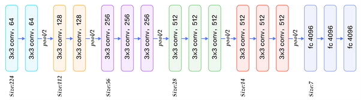

# DL-Emotion-Detector
Emotion detector model created with VGG architecture to detect emotions on webcam.

DATA SET
https://www.kaggle.com/c/challenges-in-representation-learning-facial-expression-recognition-challenge/data

Converting CSV to IMAGES
https://www.kaggle.com/c/challenges-in-representation-learning-facial-expression-recognition-challenge/discussion/29428

HAAR CASCADE MODEL
https://github.com/opencv/opencv/blob/master/data/haarcascades/
